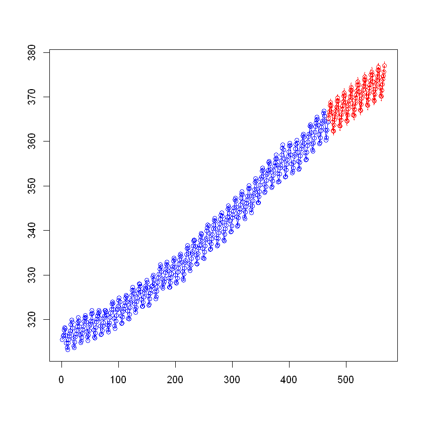

# Time Series Analysis of Mauna Loa CO₂ Data (R, itsmr)

This project demonstrates a comprehensive time series analysis of the Mauna Loa atmospheric CO₂ dataset using R and the `itsmr` package. The analysis is presented in a Jupyter Notebook and follows a practical, minimal-library approach inspired by academic coursework.

## Overview
- **Dataset:** Monthly CO₂ concentrations (ppm) from Mauna Loa Observatory, 1959–1997 (R built-in `co2` dataset)
- **Tools:** R, Jupyter Notebook, `itsmr` package
- **Focus:** Classical decomposition, differencing, ARMA modeling, model selection, diagnostics, and forecasting

## Key Steps
1. **Data Loading & Visualization:**
   - Load and plot the original CO₂ time series
   - Log-transform the series for variance stabilization
2. **Transformation:**
   - Classical decomposition (trend and seasonality removal)
   - Differencing to achieve stationarity
3. **Visualization:**
   - Plot original and transformed series
   - Plot ACF and PACF for both transformations
4. **Modeling:**
   - Fit ARMA models using Burg's, Innovations, and ARMA methods
   - Use `autofit` for automatic model selection
   - Compare models using AICc
5. **Diagnostics:**
   - Check residuals for stationarity and white noise
6. **Forecasting:**
   - Forecast next values using the optimal model

## Results & Observations
- Both classical decomposition and differencing help achieve stationarity, but decomposition yielded better model performance.
- The ARMA(3,3) model (selected by AICc) provided the best fit and satisfactory residual diagnostics.
- Residuals of the optimal model appeared to be iid noise, indicating a good fit.

## Further Ideas
- Try alternative model selection criteria (BIC, cross-validation)
- Explore SARIMA or other seasonal models
- Compare with machine learning approaches
- Perform out-of-sample validation
- Visualize forecast uncertainty and compare with actual future values
